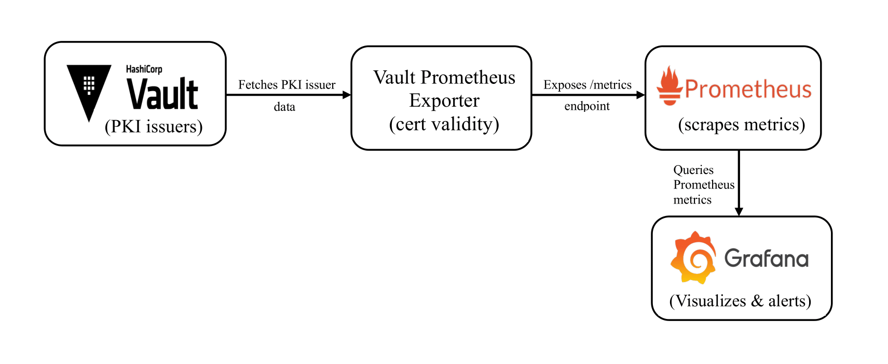

# vault-prometheus-exporter
The `vault-prometheus-exporter` monitors **HashiCorp Vault PKI issuers** and exposes **certificate validity metrics** to Prometheus.  

## Features
- Fetches PKI secrets engine issuers from Vault
- Calculates and exposes certificate validity (vault_issuer_validity_seconds) for all PKI issuers in Vault as Prometheus metrics
- Supports Vault authentication via Kubernetes service account, Vault token, or user token
- Ready-to-use Helm chart for Kubernetes deployments

## Installation

### Prerequisites
- Running **HashiCorp Vault** with at least one PKI secrets engine.
- **Prometheus** for metrics scraping.
- (Optional) **Grafana** for dashboards and alerts.
- **Kubernetes cluster** for helm deployment.

### Deploy with Helm
```bash
helm repo add vault-prometheus-exporter https://dbschenker.github.io/vault-prometheus-exporter
helm repo update
helm upgrade --install vault-prometheus-exporter vault-prometheus-exporter \
  --create-namespace -n vault-prometheus-exporter \
  --set env.VAULT_ADDR=https://vault.example.com \
  --set env.VAULT_ROLE=vault-prometheus-exporter \
  --set env.VAULT_MOUNT_POINT=kubernetes
```
### Install from local Helm chart folder

Clone the project repository and install the chart locally:

```bash
git clone https://github.com/dbschenker/vault-prometheus-exporter.git
cd vault-prometheus-exporter/chart/vault-prometheus-exporter
helm install vault-prometheus-exporter . --create-namespace -n vault-prometheus-exporter
```

## Configuration
Set the following environment variables (can also be configured via Helm values or install flags):

| Variable            | Description                                                        | Example                     | Required |
| ------------------- | ------------------------------------------------------------------ | --------------------------- | -------- |
| `VAULT_ADDR`        | The URL of the Vault server                                        | `https://vault.example.com` | ✅        |
| `VAULT_ROLE`        | Vault Kubernetes auth role bound to the exporter’s Service Account. Must match the role configured in Vault. | `vault-prometheus-exporter` | ✅        |
| `VAULT_MOUNT_POINT` | Vault Kubernetes auth mount point (commonly `kubernetes`, but may vary by setup)  | `kubernetes`               | ✅        |


## Metrics

The Vault Prometheus Exporter exposes metrics in Prometheus format.  
By default, metrics are available on **port 8080** under the `/metrics` path.

**Available metric:**

- `vault_issuer_validity_seconds{engine, issuer, url}`: Remaining validity of a Vault PKI issuer certificate (in seconds).

**Example output:**
```
# HELP vault_issuer_validity_seconds Issuer expires in seconds
# TYPE vault_issuer_validity_seconds gauge
vault_issuer_validity_seconds{engine="pki/", issuer="1234...", url="https://vault.example.com"}    2592000
```

**Metric labels:**
- `engine` → The PKI mount path in Vault  
- `issuer` → The Vault issuer ID  
- `url` → The Vault server address 

## Testing Deployment

**Check pod status:**
```bash
kubectl get pods -n vault-prometheus-exporter
```
**Port-forward and test:**
```bash
kubectl port-forward -n vault-prometheus-exporter <pod-name> 8080:8080
curl http://localhost:8080/metrics
```

## Vault RBAC Configuration
This exporter uses Vault’s **Kubernetes authentication method**.  
For details, see the [Vault Kubernetes Auth Documentation](https://developer.hashicorp.com/vault/docs/auth/kubernetes).

For secure access to Vault, it is recommended to run the vault-prometheus-exporter in Kubernetes with a **dedicated Service Account** bound to a Vault Kubernetes authentication role.

The vault-prometheus-exporter needs to authenticate with Vault and read PKI issuer certificate information. To enable this:

### 1. Create a Vault Policy

Create a Vault policy `vault-prometheus-exporter` with the following rules:

```hcl
path "pki*" {
capabilities = ["read", "list"]
}

path "sys/mounts" {
capabilities = ["read", "list"]
}
```


### 2. Apply the policy to Vault:

```bash
vault policy write vault-prometheus-exporter vault-prometheus-exporter.hcl
```

### 3. Bind the Policy to a Kubernetes Auth Role

Ensure your Vault Kubernetes authentication role has the `vault-prometheus-exporter` policy attached and is correctly bound to the Kubernetes service account running the exporter.


## Summary of Access Flow

1. The exporter running in Kubernetes uses its service account token to authenticate with Vault via the Kubernetes auth method.
2. Vault verifies the token and checks the Kubernetes auth role binding.
3. If valid, Vault grants the exporter access under the `vault-prometheus-exporter` policy.  
4. The exporter securely reads PKI issuer data from Vault and exposes it as Prometheus metrics.   


## Grafana Dashboard

The included JSON defines a Grafana dashboard configured to visualize Vault PKI issuer certificate validity. It features a pre-built time series panel displaying the remaining validity of certificate issuers, with a color-coded threshold for easy monitoring.

Users can import this JSON dashboard directly via the Grafana UI. For advanced customization, the JSON can be edited or modified through Grafana’s dashboard editor.

<details>
<summary>Dashboard JSON</summary>

```json
{
  "annotations": {
    "list": [
      {
        "builtIn": 1,
        "datasource": {
          "type": "grafana",
          "uid": "-- Grafana --"
        },
        "enable": true,
        "hide": true,
        "iconColor": "rgba(0, 211, 255, 1)",
        "name": "Annotations & Alerts",
        "target": {
          "limit": 100,
          "matchAny": false,
          "tags": [],
          "type": "dashboard"
        },
        "type": "dashboard"
      }
    ]
  },
  "description": "Vault Prometheus Exporter Dashboard",
  "editable": false,
  "fiscalYearStartMonth": 0,
  "graphTooltip": 0,
  "links": [],
  "panels": [
    {
      "datasource": {
        "type": "prometheus",
        "uid": ""
      },
      "fieldConfig": {
        "defaults": {
          "color": {
            "mode": "palette-classic"
          },
          "custom": {
            "axisBorderShow": false,
            "axisCenteredZero": false,
            "axisColorMode": "text",
            "axisLabel": "",
            "axisPlacement": "auto",
            "barAlignment": 0,
            "barWidthFactor": 0.6,
            "drawStyle": "line",
            "fillOpacity": 0,
            "gradientMode": "none",
            "hideFrom": {
              "legend": false,
              "tooltip": false,
              "viz": false
            },
            "insertNulls": false,
            "lineInterpolation": "linear",
            "lineWidth": 1,
            "pointSize": 5,
            "scaleDistribution": {
              "log": 10,
              "type": "log"
            },
            "showPoints": "auto",
            "spanNulls": false,
            "stacking": {
              "group": "A",
              "mode": "none"
            },
            "thresholdsStyle": {
              "mode": "dashed"
            }
          },
          "mappings": [],
          "thresholds": {
            "mode": "absolute",
            "steps": [
              {
                "color": "green"
              },
              {
                "color": "red",
                "value": 2592000
              }
            ]
          },
          "unit": "s"
        },
        "overrides": []
      },
      "gridPos": {
        "h": 11,
        "w": 24,
        "x": 0,
        "y": 0
      },
      "id": null,
      "options": {
        "legend": {
          "calcs": [
            "lastNotNull"
          ],
          "displayMode": "table",
          "placement": "right",
          "showLegend": true,
          "sortBy": "Last *",
          "sortDesc": false
        },
        "tooltip": {
          "hideZeros": false,
          "mode": "multi",
          "sort": "none"
        }
      },
      "pluginVersion": "",
      "targets": [
        {
          "datasource": {
            "type": "prometheus",
            "uid": ""
          },
          "editorMode": "code",
          "expr": "vault_issuer_validity_seconds",
          "legendFormat": "{{engine}}{{issuer}}",
          "range": true,
          "refId": "A"
        }
      ],
      "title": "Vault Issuer Validity",
      "type": "timeseries"
    }
  ],
  "preload": false,
  "refresh": "10s",
  "schemaVersion": 41,
  "tags": [],
  "templating": {
    "list": []
  },
  "time": {
    "from": "now-1h",
    "to": "now"
  },
  "timepicker": {},
  "timezone": "",
  "title": "Vault Prometheus Exporter",
  "uid": "",
  "version": 0
}
```

</details>

<br>
See the [official Grafana Dashboard Documentation](https://grafana.com/docs/grafana/latest/dashboards/build-dashboards/view-dashboard-json-model/) for details on dashboard JSON structure and modification.

## Architecture

The following diagram illustrates the architecture of the `vault-prometheus-exporter` monitoring setup:

- **HashiCorp Vault** acts as the certificate authority storing PKI secrets engines and issuers.
- The **Vault Prometheus Exporter** authenticates with Vault and fetches the certificate issuer data, then calculates the validity remaining for each certificate.
- The exporter exposes these metrics at HTTP `/metrics` endpoint for Prometheus to scrape regularly.
- **Prometheus** scrapes and stores these metrics, making them queryable.
- **Grafana** connects to Prometheus as a datasource and visualizes the Vault PKI issuer metrics on dashboards, providing real-time monitoring and alerting capabilities.



